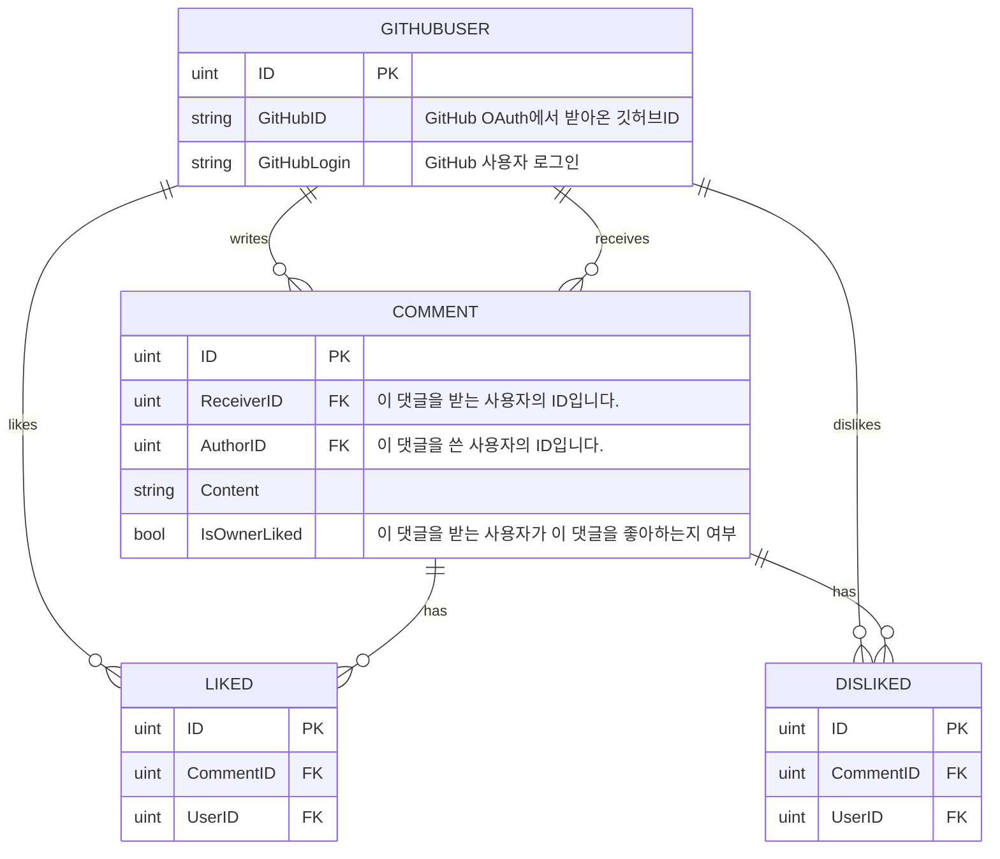

# github-profile-comments

## 목표:

GitHub 프로필에 댓글 기능을 추가하여 사용자들이 프로필에 댓글을 남길 수 있도록 합니다.

## 사용법:

1. [여기](https://comment.injunweb.com/api/auth/login)로 이동하여 회원가입을 진행합니다.
    > 1. `{"logged_in":true,"user_id":}` 이러한 응답이 나오면 성공적으로 로그인이 된 것입니다.
    > 2. 성공적으로 로그인 된 경우 창을 닫고 다음 단계로 넘어갑니다.
2. 프로필 README에 다음 코드를 추가합니다:

    ```markdown
    [](https://comment.injunweb.com/{깃허브아이디})
    ```

    여기서 `{깃허브아이디}`는 본인의 깃허브 아이디로 대체해야 하며, `{테마}`는 사용하고자 하는 테마 이름으로 대체되어야 합니다. 가능한 테마 값은 "black", "white", "transparent"입니다.

    예를 들어, 다음과 같이 사용할 수 있습니다:

    ```markdown
    [](https://comment.injunweb.com/in-jun)
    ```

    테마 파라미터를 작성하지 않는 경우, 디폴트 테마 값은 `white`입니다.

## 결과:

-   black 테마:

    [](https://comment.injunweb.com/in-jun)

-   white 테마:

    [](https://comment.injunweb.com/in-jun)

-   transparent 테마:

    [](https://comment.injunweb.com/in-jun)

## 기술 스택:

| Category   | Technologies                                                                      |
| ---------- | --------------------------------------------------------------------------------- |
| Frontend   | HTML, CSS, JavaScript                                                             |
| Backend    | Go, Gin, GORM, MySQL                                                              |
| Deployment | Cloudflare Argo Tunnel, Docker, Docker Compose, GitHub Actions self-hosted runner |
| Other      | GitHub OAuth, GitHub API, SVG                                                     |

## ER 다이어그램:


