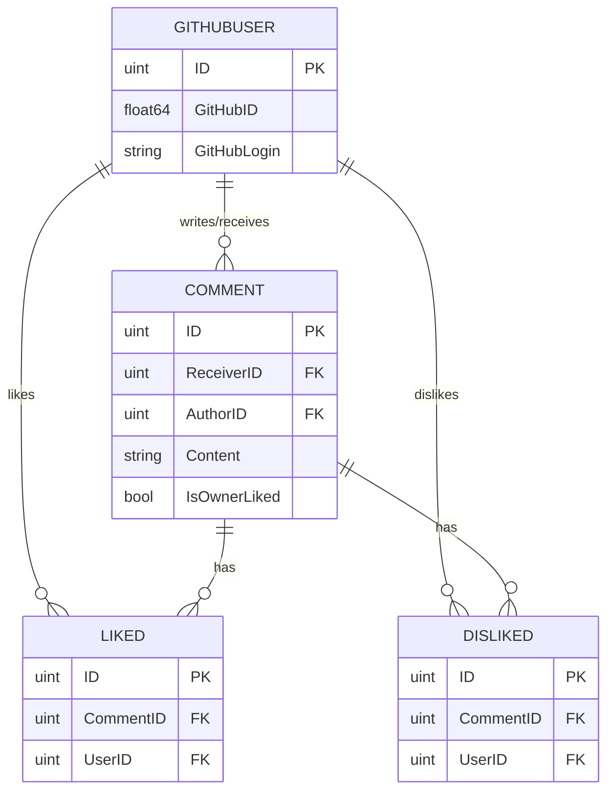

# 💬 GitHub Profile Comments

<div align="center">

[](https://goreportcard.com/report/github.com/in-jun/github-profile-comments)

> 🌟 GitHub 프로필에 댓글 기능을 추가하는 혁신적인 도구

</div>

---

## 📋 목차

-   [소개](#-소개)
-   [기능](#-기능)
-   [시작하기](#-시작하기)
-   [테마](#-테마)
-   [기술 스택](#-기술-스택)
-   [아키텍처](#-아키텍처)

---

## 📖 소개

GitHub Profile Comments는 GitHub 프로필에 동적인 소통 기능을 추가하는 도구입니다.

### 작동 방식

```mermaid
sequenceDiagram
    participant User as 사용자
    participant GitHub as GitHub OAuth
    participant Service as 댓글 서비스
    participant DB as 데이터베이스

    User->>GitHub: OAuth 로그인
    GitHub->>Service: 사용자 정보
    Service->>DB: 사용자 저장
    Service->>User: 로그인 성공
    User->>Service: 댓글 작성
    Service->>DB: 댓글 저장
```



## ✨ 기능

### 핵심 기능

-   💬 실시간 댓글
-   👍 좋아요/싫어요
-   🎨 커스텀 테마
-   🔒 GitHub OAuth 인증

### 사용자 기능

| 기능      | 설명                 | 권한        |
| --------- | -------------------- | ----------- |
| 댓글 작성 | 프로필에 댓글 남기기 | 로그인 필요 |
| 좋아요    | 댓글에 좋아요 표시   | 로그인 필요 |

## 🚀 시작하기

### 1. 회원가입

```bash
# 1. 인증 페이지 방문
https://github-comment.injun.dev/api/auth/login

# 2. GitHub OAuth 로그인 진행

# 3. 성공 응답 확인
{"github_id":123456789,"message":"Logged in successfully"}
```

### 2. 프로필 설정

```markdown
# README.md에 추가

[](https://github-comment.injun.dev/{깃허브아이디})
```

### 설치 확인

-   프로필 페이지 새로고침
-   댓글 위젯 표시 확인
-   테마 적용 확인

## 🎨 테마

### 사용 가능한 테마

| 테마        | 설명        | 예시                                                                                                                  |
| ----------- | ----------- | --------------------------------------------------------------------------------------------------------------------- |
| black       | 다크 모드   | [](https://github-comment.injun.dev/in-jun)       |
| white       | 라이트 모드 | [](https://github-comment.injun.dev/in-jun)       |
| transparent | 투명 배경   | [](https://github-comment.injun.dev/in-jun) |

## 🛠️ 기술 스택

### 프론트엔드

```yaml
UI:
    - HTML5
    - CSS3
    - JavaScript (ES6+)

기능:
    - 반응형 디자인
    - SVG 렌더링
```

### 백엔드

```yaml
서버:
    - Go
    - Gin Framework
    - GORM ORM

데이터베이스:
    - MySQL

인증:
    - GitHub OAuth
    - JWT
```

### 배포

```yaml
인프라:
    - Docker
    - injunweb (https://injunweb.com)
```

## 📐 아키텍처

### 데이터베이스 구조



---

<div align="center">

**[맨 위로 올라가기](#-github-profile-comments)**

Made with ❤️ by [in-jun](https://github.com/in-jun)

</div>
